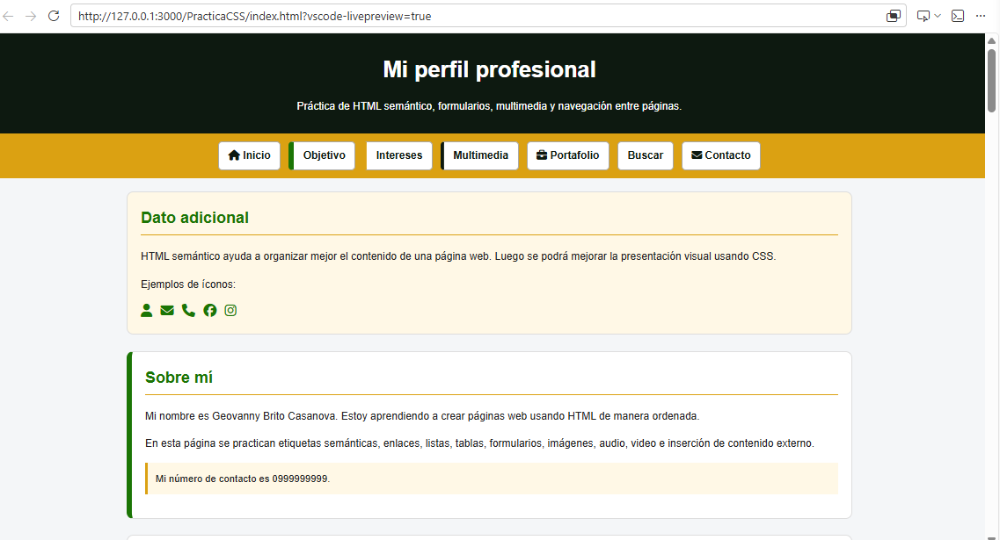
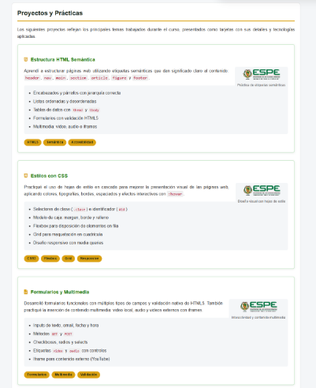
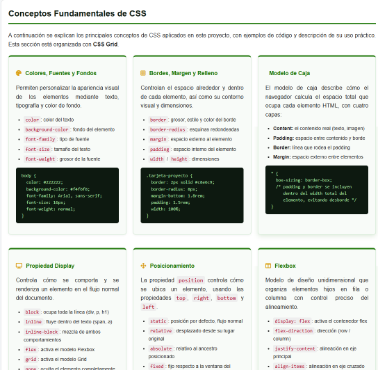
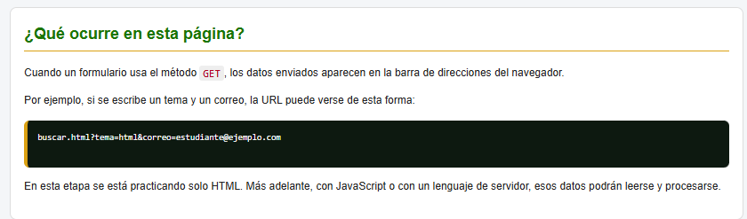

# PracticaCSS Final — Mi Perfil Profesional

## Descripción del proyecto

Sitio web estático de varias páginas construido con **HTML5 semántico** y **CSS3**,
desarrollado como práctica final del curso de Fundamentos Web 2026.  
El proyecto presenta un perfil profesional personal con secciones de objetivos,
intereses, multimedia, formularios y un portafolio que documenta el viaje de
aprendizaje en desarrollo web, incluyendo la explicación y demostración visual
de los principales conceptos de CSS.


## Estructura de carpetas

PracticaCSS/
├── index.html              ← Página principal (perfil profesional)
├── README.md
│
├── pages/
│   ├── portafolio.html     ← Portafolio CSS y conceptos de diseño
│   ├── buscar.html         ← Página de búsqueda (recibe formulario GET)
│   └── cto/
│       └── contacto.html   ← Formulario de contacto
│
├── css/
│   ├── general.css         ← Estilos compartidos por todas las páginas
│   ├── index.css           ← Estilos propios de index.html
│   ├── portafolio.css      ← Estilos propios de portafolio.html
│   ├── buscar.css          ← Estilos propios de buscar.html
│   └── contacto.css        ← Estilos propios de contacto.html
│
├── img/
│   ├── mundito.ico         ← Ícono de la pestaña del navegador
│   └── espe/
│       └── imagenEjemploEspe.png
│
├── audio/
│   └── audioEjemploA7X.mp3
│
└── video/
    └── videoEjemploDiagnostica.mp4
```

## Capturas de pantalla

> Las capturas se pueden agregar aquí una vez que el sitio esté desplegado.
> - Página principal (`index.html`) — perfil, intereses y multimedia

> - Portafolio (`portafolio.html`) — tarjetas de proyecto y grid de conceptos CSS
 

> - Búsqueda (`buscar.html`)

---

## Tecnologías utilizadas

|    **Tecnología**    |                       **Uso**                       |
|----------------------|-----------------------------------------------------|
| **HTML5**            | Estructura semántica de todas las páginas           |
| **CSS3**             | Estilos visuales, Flexbox, Grid y diseño responsivo |
| **Font Awesome 6.5** | Íconos en navegación y artículos (CDN)              |
| **Media Queries**    | Adaptación del diseño a pantallas pequeñas          |

### Conceptos de CSS aplicados

- **Colores, fuentes y fondos** — paleta verde `#1b7505`, dorado `#dba112`, oscuro `#0d1910`
- **Bordes, margen y relleno** — espaciado consistente en tarjetas y secciones
- **Modelo de caja** — `box-sizing: border-box` en todos los elementos
- **Display** — `block`, `inline-block`, `flex` y `grid` según el contexto
- **Posicionamiento** — `relative` y `float` para figuras; `sticky` disponible para nav
- **Flexbox** — menú de navegación y disposición de elementos en fila
- **CSS Grid** — sección de conceptos CSS en `portafolio.html`
- **Media Queries** — diseño responsivo para pantallas de 700 px o menos

---

## Información del autor

|       **Campo**     |               **Detalle**               |
|---------------------|-----------------------------------------|
| **Nombre**          | Corina Acosta                           |
| **Institución**     | Universidad de las Fuerzas Armadas ESPE |
| **Curso**           | Fundamentos Web                         |
| **Periodo**         | 2026                                    |
| **País**            | Ecuador                                 |
